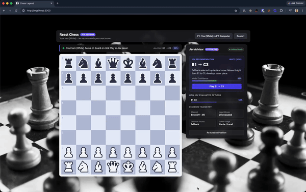

# React Chess with Jev AI Advisor

A chess web app built with React and Redux Toolkit. Player 1 plays White against a computer opponent on Black. On White's turn, an AI advisor evaluates legal moves using TypeSafe's Jev model and displays decision stats in a side panel.

## Demo

<a href="https://drive.google.com/file/d/1seKbXcjixpkGxTmlsX0wfUvnZADMAU2h/view?usp=sharing"></a>

[Watch full demo video on Google Drive](https://drive.google.com/file/d/1seKbXcjixpkGxTmlsX0wfUvnZADMAU2h/view?usp=sharing)

## How It Works

- Player 1 (White): Human player move selection, with suggestions from the Jev advisor.
- Player 2 (Black): Automated computer opponent that evaluates board moves.
- Advisor panel: Displays the recommended move, decision confidence, candidate move probability distribution, material balance, and API response time.

## Getting Started

### Prerequisites

You need [Bun](https://bun.sh) installed on your machine.

### Installation

1. Clone the repository:
   ```bash
   git clone https://github.com/aslamdoctor/react-chess-game-using-jev.git
   cd react-chess-game-using-jev
   ```

2. Install dependencies:
   ```bash
   bun install
   ```

3. Set up environment variables:
   Create a `.env` file in the project root:
   ```bash
   REACT_APP_TYPESAFE_API_KEY=your_typesafe_api_key_here
   ```

### Running the App

Start the development server:
```bash
bun start
```

Open `http://localhost:3000` in your browser.

### Running Tests

Run test suites using Bun:
```bash
bun test
```
